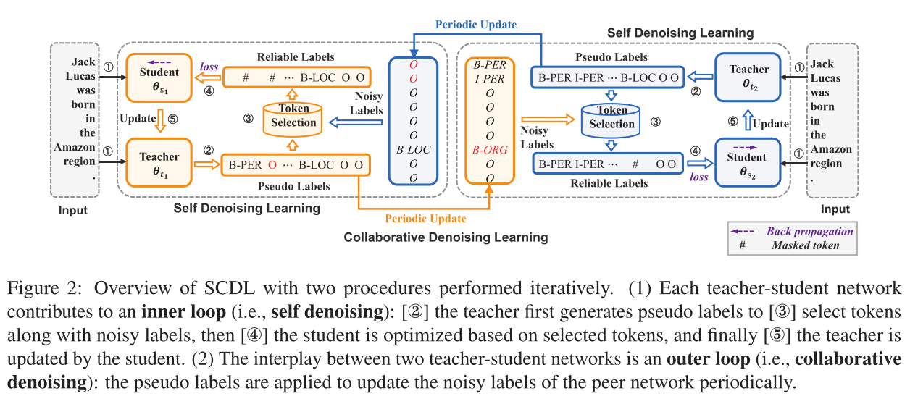

## [Improving Distantly-Supervised Named Entity Recognition with Self-Collaborative Denoising Learning (EMNLP 2021)](https://aclanthology.org/2021.emnlp-main.839/)

## Framework


## Requirements

- python==3.7.4
- pytorch==1.6.0
- [huggingface transformers](https://github.com/huggingface/transformers)
- numpy
- tqdm

## Overview

```
├── root
│   └── dataset
│       ├── conll03_train.json
│       ├── conll03_dev.json
│       ├── conll03_test.json
│       ├── conll03_tag_to_id.json
│       └── ...
│   └── models
│       ├── __init__.py
│       └── modeling_roberta.py
│   └── utils
│       ├── __init__.py
│       ├── config.py
│       ├── data_utils.py
│       ├── eval.py
│       └── ...
│   └── ptms
│       └── ... (trained results, e.g., saved models, log file)
│   └── cached_models
│       └── ... (RoBERTa pretrained model, which will be downloaded automatically)
│   └── run_script.py
│   └── run_script.sh
```

## How to run
```console
sh run_script.sh <GPU ID> <DATASET NAME>
```
e.g., 
```console
sh run_script.sh 0 conll03
```
Specific parameters for different datasets can be found in our paper, and then modify them in ```run_script.sh```.

## Notes and Acknowledgments
The implementation is based on https://github.com/cliang1453/BOND

## Citation
```
@inproceedings{zhang:2021,
  title={Improving Distantly-Supervised Named Entity Recognition with Self-Collaborative Denoising Learning},
  author={Xinghua Zhang and Bowen Yu and Tingwen Liu and Zhenyu Zhang and Jiawei Sheng and Xue Mengge and Hongbo Xu},
  booktitle={Proceedings of the 2021 Conference on Empirical Methods in Natural Language Processing},
  year={2021}
}
